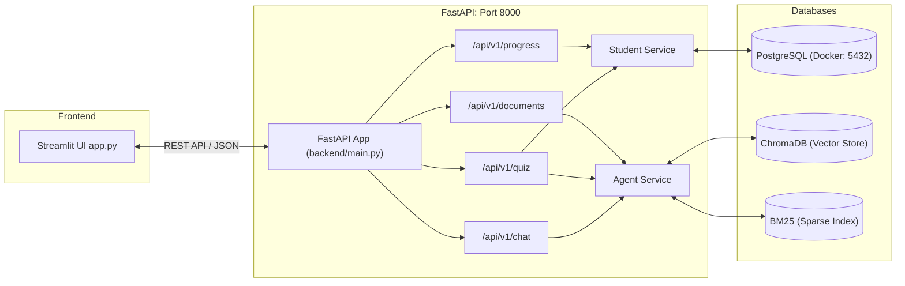

# Agentic AI Tutor: Production FastAPI & PostgreSQL Architecture

## Overview

Agentic AI Tutor is an adaptive learning system designed for competitive exams. It features a decoupled **FastAPI REST API**, **PostgreSQL** persistence via Docker & SQLAlchemy, **Groq Cloud LLM** inference (`llama-3.3-70b-versatile`), and **Hybrid RAG** (ChromaDB HNSW + BM25).

---

## 🏛️ System Architecture



---

## 🚀 Quick Start Guide

### 1. Start PostgreSQL with Docker

Run the following command in the project root:

```bash
docker compose up -d
```
*(Or use `docker run --name ai_tutor_postgres -e POSTGRES_PASSWORD=postgres -e POSTGRES_DB=ai_tutor_db -p 5432:5432 -d postgres:16-alpine`)*

---

### 2. Install Python Dependencies

```bash
pip install -r requirements.txt
```

---

### 3. Verify Database Connection

Run our automated database check:
```bash
python test_db.py
```

---

### 4. Start the FastAPI Backend Server

```bash
uvicorn backend.main:app --reload --port 8000
```
* **Interactive API Docs (Swagger UI):** Open [http://localhost:8000/docs](http://localhost:8000/docs)
* **Health Check:** [http://localhost:8000/health](http://localhost:8000/health)

---

### 5. Launch the Streamlit Frontend

In a separate terminal:
```bash
streamlit run app.py
```

---

## 📊 PostgreSQL Database Tables

| Table Name | Description |
| :--- | :--- |
| `students` | Registered student profiles and creation timestamps |
| `topic_performances` | Live rolling accuracy, attempt counts, and strength classifications (`strong`, `medium`, `weak`) |
| `quiz_attempts` | Full history of every quiz taken, score, and percentage |
| `quiz_questions` | Individual question logs, options, user answers, correct answers, and explanations |
| `study_materials` | Record of uploaded notes and study materials |

---

## 🔌 API Endpoints Reference

| Method | Endpoint | Description |
| :--- | :--- | :--- |
| `POST` | `/api/v1/chat` | Process student message, classify intent, and generate RAG explanation |
| `POST` | `/api/v1/quiz/generate` | Generate adaptive MCQ quiz tailored to student's DB mastery level |
| `POST` | `/api/v1/quiz/submit` | Auto-grade quiz, update topic performance, and persist to PostgreSQL |
| `GET` | `/api/v1/progress/{student_id}` | Fetch full learning metrics and recommendations |
| `POST` | `/api/v1/documents/ingest` | Chunk and index text into ChromaDB & BM25 |
